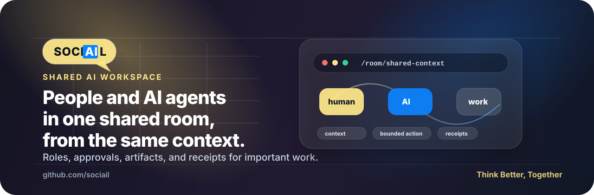

> 🔗 Sociail Team
> [✅ Tasks](https://github.com/orgs/sociail/projects) | 
> [📦 Repos](https://github.com/orgs/sociail/repositories) | 
> [👋 Onboarding](https://github.com/sociail/docs/wiki/onboarding) | 
> [💻 Localdev](https://github.com/sociail/localdev) | 
> [📚 Wiki](https://github.com/sociail/docs/wiki)

 

# Sociail

## Think Better, Together

Most AI agents can react. Ours can participate.

Sociail is a shared AI workspace where people and room-aware AI teammates work in the same room — with visible roles, shared context, approval-aware actions, durable outputs, and receipts for important work.

[Website](https://www.sociail.com) · [How It Works](https://www.sociail.com/how-it-works) · [Trust](https://www.sociail.com/trust) · [Early Access](https://www.sociail.com/early-access) · [Careers](https://www.sociail.com/careers) · [Contact](https://www.sociail.com/contact)

## What we are building

Sociail brings AI out of private tabs and into shared rooms.

Humans and AI teammates participate in the conversation with names, roles, attribution, approval-aware boundaries, and visible receipts. The goal is not another assistant window. The goal is shared intelligence: people and AI working from the same context, preserving decisions, surfacing tradeoffs, and turning conversation into work that lasts.

Early Access starts with one room, one workflow, and one measurable proof point.

## What makes a Sociail teammate

A Sociail teammate earns capability in layers:

- **Context** — understands the room, task, sources, and constraints before answering.
- **Role** — carries a declared role, tone, priorities, and boundaries.
- **Memory** — keeps accepted context, artifacts, decisions, and corrections connected to the work.
- **Bounded action** — prepares drafts or stages work while consequential changes stay review-first.
- **Follow-through** — checks back on narrow work and surfaces what is stuck.

## GitHub

Most Sociail repositories are internal while we build. This organization is where our team coordinates product, infrastructure, docs, experiments, and the systems behind the shared AI workspace.

Team members can use the internal links below:

- [Tasks](https://github.com/orgs/sociail/projects)
- [Repositories](https://github.com/orgs/sociail/repositories)
- [Localdev](https://github.com/sociail/localdev)
- [Docs](https://github.com/sociail/docs)
- [Onboarding](https://github.com/sociail/docs/wiki/onboarding)

## People

We hire slowly. On purpose.

We do not have open roles right now, and we are not posting filler roles to keep a page warm. When we post a role, it means the work is real and the timing is real.

That said, we are always interested in people who:

- think in systems,
- actually ship,
- write to clarify thinking,
- take responsibility, and
- care about the problem Sociail is taking on.

If that sounds like you, start with the [Sociail Careers page](https://www.sociail.com/careers). Tell us what you have built, what you care about, and why Sociail's bet resonates.

For partnerships, Early Access, media, support, or anything that is not career-related, use the [Sociail Contact page](https://www.sociail.com/contact).

## Learn more

- [Request Early Access](https://www.sociail.com/early-access)
- [Careers](https://www.sociail.com/careers)
- [Contact](https://www.sociail.com/contact)
- [Trust](https://www.sociail.com/trust)
- [Blog](https://www.sociail.com/blog)

---

Built with heart and care for humans and AI.

© 2026 Sociail, Inc. All rights reserved.  
Unauthorized copying, modification, distribution, or use of this software is strictly prohibited.
